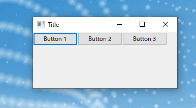

# ノートPCでPython+wxPython環境構築（ついでにMKL NumpyとMKL Scipy）

2020-04-27（一部修正含む）

## はじめに

このページはWindows 8.1および10，macOS 10.15 (catalina), Linux (ubuntu 18.04)へのPython3系と関連モジュールをインストールした経験メモです．**このページに記載された方法を試して何らかの不具合が生じても本ページ管理者は全く責任を負いません**．pythonやlinuxのインストールは**自己責任**で行って下さい．</br>

注意：このページ管理者は「にわかプログラマー」です．</br>

PythonはWindows, macOS, Linuxに加えてiOS，アンドロイドでも利用できるプログラミング言語です．Pythonのグラフィック・ユーザー・インターフェイス（GUI）モジュールであるwxPythonと組み合わせるとWindows，macOS，Linuxで作動するプログラムを書けることに興味を持ち，いろいろ試した結果です．wxPythonはライセンスがゆるめで使いやすい気がします．</br>

Pythonは複数のバージョンやインストールされたモジュール数が異なる環境を使うことが多いようです．本ページでは複数バージョンのPython環境の構築が目的の一つであるため，[pythonの本家本元サイト](http://www.python.org)からダウンロードする方法は用いていません．</br>

さらに数値演算を高速化するIntel Math Kernel Library (MKL)を組み込んだNumpy, Scipyのインストール法も記載しました．Windowsでは簡単，mac OSは超苦労，Linuxではやや苦労しました．</br></br>


## Windows編

WindowsへのPython環境構築には[Anaconda](https://www.anaconda.com/)と[WinPython](http://winpython.github.io/)を試しましたが，現在はWinPythonのみを使っています．Anacondaを使わなくなった理由は，インストールされているGPL版pyQtをCommercial版pyQtに置き換えられなかったためです．（数年前の話．Anadondaパッケージにはpython3.dllが含まれていないためでした）</br>

WinPythonフルバージョンはAnacondaと同様に様々なモジュールや統合開発環境ソフトがプレインストールされています．科学技術計算に必要なモジュールも多数含まれていることから大変便利です．</br></br>

WinPythonの場合，プレインストールされているモジュールの置き換えも簡単（逆にトラブルも起こりうる）で，pipでモジュールの追加や削除を実行できます．commercial版pyQtへの置換も簡単にできました．</br>

その他，WinPythonの場合，仮想環境の構築が容易でPath設定をしなくとも使用できることが魅力です．</br>

####  WinPythonのインストール方法

[WinPythonホームページ](http://winpython.github.io/)からダウンロードサイトに移動し，使いたいバージョンのPythonに相当するWinPython####.exeをダウンロードし適当なフォルダー保存します．####部分には32，64ビット，Pythonバージョン番号などが付きます．あとは保存したWinPython####.exeをダブルクリックして好きなフォルダーへ展開するだけです．</br>

WinPythonホームページにも記載されていますが，WinPython利用において，Windows 8..10ユーザーは[Microsoft Visual C++ Redistributable for Visual Studio 2017..2019](https://support.microsoft.com/en-us/help/2977003/the-latest-supported-visual-c-downloads) (WinPython 32bitにはvc_redist_x86.exe， WinPython 64bitには vc_redist_x64.exe）をインストールする必要がありそうです．実際にプログラムを走らせてみてエラーが出る場合など必要に応じてインストールして下さい．</br>

ファイル名末尾に"Zero"が付いているものは最小限のモジュールとIDEのみのバージョンです．自分で様々なモジュールをインストールするのが面倒であればファイルサイズが大きいものを選択すればよいです．</br>

#### WinPython利用法

Winpython64-3.8.1.0cod.exeをダブルクリックしてできるWPy64-3810フォルダー内ファイル構成です．</br>


license.txtを確認するとMITライセンスであることがわかります．MITライセンスについては[こちら](https://ja.wikipedia.org/wiki/MIT_License)．</br>

プログラム開発用の統合開発環境ソフトにはPyzo，Spyder，VSCodeがプレインストールされています．</br>

WindowsシステムにPath設定しなくともPyzo，Spyder，VSCode，JupyterNoteBookなどでPythonコードを走らせることができます．つまりWinPython####.exeを展開しただけの状態で使用すると仮想環境で利用することになります．（USBメモリーに展開すると持ち運び可能な開発環境になります）</br>

**注意**：ZeroバージョンのWInPythonにも同じ内容が表示されますが必要とするPythonモジュールが含まれていないためSpyder, WinPython Control Panelなどは使えません．</br>

仮想環境下でPython用モジュールをインストールする場合はWinPythn Command Prompt.exeまたはWinPython Powershell Prompt.exeを立ち上げ，通常のPython環境と同様にpipコマンドで行います．pipコマンドについてはググって下さい．その他，WInPython Control Panelからも行えます．こちらは[WinPythonのホームページ](https://winpython.github.io/)を参照して下さい．</br>

グローバル環境に設定したい場合はWinPython Control Panelをダブルクリックし，メインメニューにある"Advanced"から"Resister Distribution"を設定すればよいらしいです．←試したことはありません．自己責任で試して下さい．</br>

グローバル環境にするとスタートメニュー→Windowsシステムツール→コマンドプロンプトまたはスタートメニュー→Windows Powershellからpipコマンドを使えます（たぶん）</br>

#### その他，必要なモジュールのインストール

本管理者非線形最小自乗法を使うデータ解析とグラフ表示を行うため，Numpy, Scipy, lmfit, Matplotlibを使います．これらのモジュールはフルバージョンのWinPythonであればプレインストールされています．特にnumpyはIntel MKLビルド版とサービス満天です．Zero版の場合は自身でインストールしてください．pipコマンドでインストール可能です．</br>


#### wxPythonインストール

wxPythonモジュールはWinPythonにプレインストールされていません．wxPythonを使う場合は[wxPythonホームページ](https://www.wxpython.org/)のダウンロードページでサポートするPythonバージョンを確認し，使用するPythonバージョンを決めましょう．最新バージョンのPythonはサポートされていないことがあります．</br>

wxPythonのインストールはWinPython Command Prompt，WinPython Powershell Promptを立ち上げ，

`pip install wxpython`

と入力すればOKです．proxy設定が必要な場合はpipのヘルプまたはググって下さい．基本は

```
pip install [モジュール名] --proxy [user:passwod@]proxy.server:port
```

です．</br>

**補足情報**：Windows用のPython用バイナリーモジュールは[Unofficial Windows Binaries for Python Extension Packages](https://www.lfd.uci.edu/~gohlke/pythonlibs/)ページから取得することもできます．このページには各モジュールの簡単な説明が付いていますので，どんなモジュールがあるのか？辞書代わりになります．MKLビルド版numpyとScipyのバイナリーもアップロードされていますので，これらも簡単にインストールできます．</br></br>


## mac OS編

mac OSはシステムでPythonを使っています．したがってOSにインストールされているPythonとは異なる仮想環境下でPythonをインストールする必要があります．</br>

仮想環境下へのPythonインストールにはAnacondaあるいはHomebrew + pyenvを用いた方法などがあるようです．本ページ管理者はWIndowsの場合と同様にpyQtをcommercial版に置き換えたかったこと，複数バージョンのPython環境を構築したかったことからHomebrew + pyenvを用いた環境構築を採用しました．使用したマシンとOSは下記です．

・MacBook Air（13-inch, Early 2015モデル），250GB HD，8 GBメモリ

・mac OS: 10.15.4 (Catalina)

現行のmac OS 10.15 (Cataline)へのHomebrewとpyenvのインストールについては「[MacOSとHomebrewとpyenvで快適python環境を。](https://qiita.com/crankcube/items/15f06b32ec56736fc43a)」ページの通りに行えばpyenvをインストールするところまでは同じ操作で大丈夫です．</br>

「[MacOSとHomebrewとpyenvで快適python環境を。](https://qiita.com/crankcube/items/15f06b32ec56736fc43a)」ページにも書かれていますがPythonのインストールは自前でコンパイルされます．（なのでXCodeのインストールが事前に必要）wxPythonはmac OSのライブラリにアクセスするため，Pythonインストール時にOSライブラリにリンクを張るオプションをつける必要があります．したがって（例えばPython3.8.1の）インストールは

```
pyenv install 3.8.1
```

ではなく

```
env PYTHON_CONFIGURE_OPTS="--enable-framework" pyenv insatll 3.8.1
```

とする必要があります．このオプションを付けないでインストールしたPythonでwxPythonコマンドを含むプログラムを走らせると

```
This program needs access to the screen. Please run with a
Framework build of python, and only when you are logged in
on the main display of your Mac.
```

というエラーメッセージが出て止まります．</br>

あとは「[MacOSとHomebrewとpyenvで快適python環境を。](https://qiita.com/crankcube/items/15f06b32ec56736fc43a)」ページと同じく普段使用するPythonを設定するためターミナルから下記コマンドを入力します．（Python 3.7.7の場合）

```
pyenv global 3.8.1
```

念のためPython設定が正しいかを

```
pyenv versions
```

または

```
python --version
```

で確認してください．


本ページ管理者は非線形最小自乗法によるデータ解析およびグラフ表示も行うためNumpy, Scipy, Matplotlib, lmfitもインストールしました．ターミナルから下記コマンドを入力するだけでインストールできます．

`pip install numpy scipy matplotlib lmfit`

普段使用するPythonの設定が正しければ，wxPythonのインストールはターミナルから

```
pip install wxpython
```

と入力すればOKです．</br></br>

Pythonの統合開発環境であるSpyderはpipでインストールできます．</br>

ターミナルから

```
pip install spyder
```

と入力すればインストールできます．インストール後ターミナルから

```
spder3
```

または

```
spyder3&
```

と入力すれば立ち上がります．</br>

**補足**：PYTHON_CONFIGURE_OPTS="--enable-framework"とPYTHON_CONFIGURE_OPTS="--enable-shared"については「[PYTHONビルド時の--enable-frameworkと--enable-sharedの違い](https://abrakatabura.hatenablog.com/entry/2017/07/08/130407)」に解説があります．</br>

**おまけ**：NumpyでIntel MKL (Math Kernel Library)を使うと計算が速くなるモジュールもあります．mac OSの場合，自身でMKLを導入してNumpy, Scipyをビルドしなおすのは大変です．この様な用途の場合は素直にAnacondaを使いましょう．Anacondaにはnumpy+mkl，scipy+mklがプレインストールされているようです．Anacondaパッケージはpyenvからインストールできます．</br></br>


**MKL Numpy+ MKL Scipyのインストール法**

Anacondaを使わない場合は[ここ](https://qiita.com/Ishotihadus/items/f7d82a1f3a3ca6900bf7)を参照してインストールできました．ただしMKL Numpyのみ成功です．MKL Scipyについては(5)を読んで下さい．</br>

(1) IntelからMKLをダウンロード+インストール．インストールパスはデフォルトの/opt/intelのまま</br>

(2) .numpy.cfgファイルをホームディレクトリに作成．内容は

```
[mkl]
library_dirs = /opt/intel/mkl/lib
include_dirs = /opt/intel/mkl/include
mkl_libs = mkl_rt
```

(3) pipでビルド（pip.conf）を書かない方法．

```
pip install --no-binary :all: numpy
```

(4) @rpathの追加．このままだとpythonでimport numpyとしたときに，Pythonが@rpath/libmkl_rt.dylibを見つけられなずエラーが発生する．（[[Mac に MKL 版 numpy / scipy をインストールする](https://qiita.com/Ishotihadus/items/f7d82a1f3a3ca6900bf7)]を参照）この現象，.zshrcでLD_LIBRARY_PATHを指定しても解決できないらしい．そこでエラーが出たso ファイルに、強引に @rpathを追加します．パス名はインストールされている環境に合わせてます．ターミナルで下記コマンドを実行（「[MacOSとHomebrewとpyenvで快適python環境を。](https://qiita.com/crankcube/items/15f06b32ec56736fc43a)」に記載されているパスにpyenvとPython3.8.1がインストールされている場合）

```
install_name_tool -add_rpath /opt/intel/mkl/lib /usr/local/var/pyenv/versions/3.8.1/Python.framework/Versions/3.8/lib/python3.8/site-packages/numpy/core/_multiarray_umath.cpython-38-darwin.so
```

/usr/local..以降はインストールされているパスに依存します．「[Mac に MKL 版 numpy / scipy をインストールする](https://qiita.com/Ishotihadus/items/f7d82a1f3a3ca6900bf7)」」のテストにあるようにPythonからimport numpyを実行し，出力されるエラーに含まれるパス名を確認して下さい．</br>

(5) Scipyについては[[Mac に MKL 版 numpy / scipy をインストールする]](https://qiita.com/Ishotihadus/items/f7d82a1f3a3ca6900bf7)ページとは異なりScipyをビルドしてインストールすることはできませんでした．同じ現象は[MacにPython3とMKL+Numpyをインストール](https://tm23forest.com/contents/mac-python3-install-numpy-mkl)ページにもあることからMKL Scipyは諦めかけました．</br>

偶然[[pyenv+poetry環境下のnumpy,scipyでmklを使いたい](https://qiita.com/yano404/items/b78503749c2e45b4b638)]を見たところ，pep517を使わないレガシー・インストールでMKL Scipyのインストールに成功したとありましたので下記コマンドを試行．

```
pip install --no-use-pep517 --no-binary :all: scipy
```

するとエラーなしにMKL Scipyをインストールできました．すこし時間がかかります．ここまで来るのに滅茶苦茶苦労しました．．．

ちなみにpip install --no-use-pep517 --no-binary :all: numpyとしても@rpathの問題は避けられません．</br></br>


## Linux編

**注意**：Linux導入は敷居が高いです．またCドライブ内の情報が消去されてしまう可能性もありますのでサブマシンへの導入がよいと思います．Linuxは古いPCでも軽快に動きますので中古PCやサポートが終わってしまったOSがプレインストールされているPCに導入しても十分使えます．（例えば[こちら](http://www.gadgets-today.net/?p=3591)とか，[こちら](http://lioon.net/lubuntu-the-best-for-letsnote)とか，[こちら](https://note.com/you_kyan/n/n101d8a580286)のページ）</br>

#### Distribution選択

Linuxには様々なdistribution版があり，どれを選べばよいか？から既に挫けそうです．Linuxのdistributionについては[こちら](https://ja.wikipedia.org/wiki/Linux%E3%83%87%E3%82%A3%E3%82%B9%E3%83%88%E3%83%AA%E3%83%93%E3%83%A5%E3%83%BC%E3%82%B7%E3%83%A7%E3%83%B3)．その他，[【2020年】初心者にオススメなLinuxディストリビューション](http://note.kurodigi.com/linux-distro-2020/)．本管理者はwxPythonを使える環境が欲しかったので，まず[wxPythonのホームページ](https://www.wxpython.org/)を確認しました．[wxPython Downloads](https://www.wxpython.org/pages/downloads/)にLinuxの注意が書かれています．さらに[wxPython Extras linuxのgtk3フォルダ](https://extras.wxpython.org/wxPython4/extras/linux/gtk3/)を確認するとcentos-7, debian-8, 9, fedra-24~28, ununtu-14.04-18.04ならインストールできそうだと思われます．（注：2020-04-27以前の画像です．2020-04-27大幅にサポートdistributionが増えましたのでインストール前に確認して下さい）


ubuntuには[日本語Remix](https://www.ubuntulinux.jp/home)版がありサイト情報も多いことから私のような初心者でも何とかなりそう．そこでubuntuのデスクトップ版で長期サポートバージョンのUbuntu 18.04.3 LTSを選択しました（長期と言っても2023年まで）．導入を試みたPCはWIndows 8.1がインストールされたPanasonic製Let's Note CF-MX3です．SSD（250GB），RAM 8GB実装マシンです．</br>

#### ライブDVD作成とテスト起動

ubuntuには[日本語Remix](https://www.ubuntulinux.jp/home)版サイトから[ubuntu-ja-18.04.3-desktop-amd64.iso（ISOイメージ）](http://cdimage.ubuntulinux.jp/releases/18.04.3/ubuntu-ja-18.04.3-desktop-amd64.iso)をダウンロード，DVDに焼いて起動ディスク（ライブDVD）を作成します．[Ubuntu 18.04 その89 - UbuntuのライブDVDを作成するには（Windows編）](https://kledgeb.blogspot.com/2018/04/ubuntu-1804-89-ubuntudvdwindows.html)などを参考にしました．ubuntuをライブDVDから起動するとインストールしなくてもubuntuを試用することができます．（[Linux_OS　Ubuntuの試用、ライブＤＶＤ起動のすすめ](https://blog.goo.ne.jp/goosyun/e/5ae3456c18121843857be0b51c5d1e3c)）</br>

[UEFIモードでUbuntuをインストールする方法（Ubuntu 16.04 LTS）](https://www.archlinux.site/2018/02/uefiubuntuubuntu-1604-lts.html) を頼りに，ライブDVDから起動するための準備としてWindowsの「コントロールパネル」→「電源オプション」→「電源ボタンの動作を設定する（システム設定）」で**高速起動のチェックを外します**．（[windows8のPCにUbuntuをインストールしデュアルブート環境で使う](https://smartgoods.me/2014/07/windows8_ubuntu_dualboot/)も参照）．その後，windowsを再起動し，PCメーカーのロゴが表示されているタイミングでBios設定画面を呼び出し（今回のPCではF2キー連打で表示），メニューから光学ドライブ電源を「オン」，起動メニューにあるUEFI起動は初期設定の「有効」にしたまま，UEFI優先度でハードディスクUEFI起動を「無効」，光学ディスクドライブUEFI起動を「有効」に変更，セキュリティーメニューの「セキュアブート」にある「セキュアブート制御」を「無効」に変更し，ライブDVDをセットして再起動しました．が，この設定では起動途中でgrubプロンプトが表示されてとまってしまい，[Ubuntu 18.04 LTSインストールガイド【スクリーンショットつき解説】](https://linuxfan.info/ubuntu-18-04-install-guide)ページのようには進まず最初の挫折  ○|￣|＿　</br>

気を取り直して今度はBios設定でUEFI起動を「無効」にし，光学ドライブの起動優先順位をハードディスクよりも先に変更したところ[Ubuntu 18.04 LTSインストールガイド【スクリーンショットつき解説】](https://linuxfan.info/ubuntu-18-04-install-guide)ページの通り試用画面が表示されました．この設定でインストールできそうなことを確認し，次はWindows Cドライブのパーティションサイズ変更を行います．</br>

#### Cドライブパーティションサイズ変更

Windows 8.1のサポートは継続されていることからWindows 8.1とubuntu-Desktop 18.04 LTSのデュアルブート化を目指します．UbuntuをインストールするにはCドライブのパーティションサイズを変更する必要があります．当然，Cドライブにある情報が消えるリスクも高いので必ず起動ディスク作成とバックアップを事前に行って下さい．さらにCドライブのプロパティーから「このディスクのクリーンアップ」を実行しデフラグします．「[Windows PCでOSをデュアルブートするときの覚え書き](https://www.cottpic.com/2019/01/dualboot-on-windows.html)」にあるように[MiniTool Partition Wizard Free Edition](https://www.partitionwizard.com/free-partition-manager.html)などのツールを使うとCドライブ内の情報を残したままパーティションサイズを変えられる様です．ただし**設定を間違えるとウンも言わさず工場出荷状態に戻されます**．工場出荷状態に戻っても良い場合はWindowsの「ディスクの管理」マネージャーでサイズ変更しても構いません．（もちろんバックアップと起動ディスクは必須です．細心の注意が必要です）今回はWindows用に150GB，Ubuntu用に100GBに分割しました．Ubuntu用に分割したパーティションはフォーマットなどせず未設定のママで大丈夫です．</br>

#### デュアルブートでUbuntuインストール．．．（やや不満ありの結果）

Ubuntu 16.04での情報だが[【初心者でもわかる】Ubuntuのインストール方法](https://eng-entrance.com/ubuntu-install)まとめが参考になりました．上記のテスト起動法でライブDVDを起動するとubuntuのインストールボタンがある画面が現れるので，"Ubuntuをインストール"ボタンを押します．</br>

**危険：インストールの種類でデフォルトの「ディスクを削除してUbuntuをインストール」を選択すると，VirtualBoxをインストールしていなければハードディスクを丸ごと使われてしまうのでデュアルブートはできなくなります（当然Cドライブ内のWindows関係データは全て消えます）．**</br>

デュアルブートにする場合は「その他」を選択し手動でパーティション設定します．この後の設定は[【初心者でもわかる】Ubuntuのインストール方法](https://eng-entrance.com/ubuntu-install)とほぼ同じにしたが「基本パーティション，ext4ジャーナリングファイルシステム，マウントポイント"/"」のパーティションと「スワップ領域」のみ追加しました．スワップ領域は物理メモリの1～2倍が適正値とあるので8GBにしました．あとは言われるがままに設定入力するだけでインストールが終わります．最後に再起動すればUbuntuが立ち上がります．</br>

再起動すると最初に現れるUbuntuブートローダーにWindows Boot Managerが表示されないことに気付きました．Ubuntuのアクティビティーから端末アプリを立ち上げ

```
ls /sys/firmware/efi/
```

と入力すると，そんなフォルダはないと怒られました．インストールされたシステムはUEFIではなくレガシーBios起動設定でインストールされていました．この設定だとBiosを立ち上げUEFI起動を有効にするとWindows，無効にするとUbuntuがブートするシステムになってしまいました．（Bios設定を考えれば当たり前です）できることならUbuntuもUEFIブートにしたいが，ネット検索した限りレガシーBiosブートシステムを後からUEFIブートに変えることは難しそうでした．

2度目の挫折 ○|￣|＿</br>

#### Ubuntuの再インストール（結果オーライ）

ライブDVD起動で失敗したため，次はライブUSBから立ち上げに挑戦．[UbuntuのライブUSBをつくる](https://blog.mktia.com/how-to-make-ubuntu-live-usb/)ページを参考にして[Universal USB Installer](https://universal-usb-installer.jp.uptodown.com/windows)を使ってライブUSBを作成しました．再びBios設定をUEFI起動を「有効」，UEFI優先度のハードディスクUEFI起動と光学ドライブUEFI起動を「無効」に設定しなおし，終了メニューから「設定を保存して再起動」を選択します．同時にUSBポートにライブUSBをさしてブートアップすると，Ubuntuが既にインストールされているためかライブデスクトップが表示されるまで進みました．デスクトップに現れるインストーラーアイコンをダブルクリックするとインストールが進み，無事UEFIブートUbuntuがインストールできました．</br>

インストール後の再起動時，PC製造メーカーのロゴが表示されているタイミングでBios設定を立ち上げ（今回マシンの場合はF2連打），UEFI優先度のハードディスクUEFI起動と光学ドライブUEFI起動を「有効」に再設定します．さらにUEFI起動の順位でUbuntuとWindowsの順番も変更できるようになっていますので好みに合わせて再設定して下さい．設定が終わったら「変更を保存して再起動」します．

ようやくUbuntuブートローダーでUbuntuとWindowsの起動を選択できるデュアルブート化に成功しました．（ライブUSBを用いれば最初からUEFIインストールに成功するのか？一度レガシーBios設定でインストールした後，UEFI起動インストールしたから成功したのか？はわかりません）</br>

次は[Ubuntu 18.04 LTSのインストール直後にやっておきたいことまとめ](https://linuxfan.info/ubuntu-18-04-basic-settings)や[Ubuntu 18.04 LTSをインストールした直後に行う設定 & インストールするソフト](https://sicklylife.jp/ubuntu/1804/settings.html)や[Ubuntu 16.04LTS を Let's Note SZ6 にデュアルブートインストール](http://yang.amp.i.kyoto-u.ac.jp/~yyama/Ubuntu/version/Ubuntu16.04LTS_sz6.html)を参考に設定変更，必要なソフトインストールを行います．（特に[ファイアーウォールを有効にする](https://sicklylife.jp/ubuntu/1804/settings.html#gufw)とか”[他からの接続を禁止](http://yang.amp.i.kyoto-u.ac.jp/~yyama/Ubuntu/version/Ubuntu16.04LTS_sz6.html)"とか[セキュリティーソフトのインストール](https://ja.safetydetectives.com/blog/best-antivirus-for-linux-ja/)とか）Pythonインストールは後で行います．またLet's NoteへUbuntuをインストールするとでる固有の問題？は[Let's note SZ で Ubuntu](http://iranoan.my.coocan.jp/essay/pc/201609061.htm)を参考にして設定を微修正することで解決しました．</br>

#### Ubuntuへのライブラリ追加

wxPythonをUbuntuで利用するためにはライブラリを追加インストールする必要があることがわかりました（[[ubuntu16.04のpython3にwxpythonをインストールする](https://qiita.com/hotstaff/items/b3f8bb4c3c098d95925c)]や[github, "[Error running configure" when installing from PyPi #412](https://github.com/wxWidgets/Phoenix/issues/412)"]参照）Ubuntuのアクティビティーから端末アプリを立ち上げ下記コマンドを入力すればインストールできます．アクティビティーは下図


アクティビティーウィンドウの端末アプリは下図


端末アプリを立ち上げ，ウィンドウに下記コマンドを入力．

```
sudo apt-get install -y libgtk2.0-dev libgtk-3-dev libjpeg-dev libtiff-dev libsdl1.2-dev libgstreamer-plugins-base1.0-dev libnotify-dev freeglut3 freeglut3-dev libsm-dev libwebkitgtk-dev libwebkitgtk-3.0-dev
```

私には[wxPythonページ](https://www.wxpython.org/blog/2017-08-17-builds-for-linux-with-pip/index.html)の情報から上記を読み取る能力はありません．．．（難しすぎ）でも上記コマンドで無事必要なライブラリはインストールできました．</br>

#### Pyenvインストール

UbuntuもOSにPythonが含まれています．したがってmac OSと同様に仮想環境下でPythonをインストールする必要があります．事前調査不足でLinuxBrewなるパッケージ管理プログラムが存在するのを知りませんでした．**(2020-04-27追記)：後からLinuxBrewをインストールし，先にインストールしたPythonのconfigureファイルを認識させる方法を下に追記しました．**[[ubuntu 18.04 に pyenv をインストールする話](https://qiita.com/pdv/items/1107bcdca7fa43de673d)]を参照してpyenvをインストールしました．brewなしの直接インストールです．はじめにpyenvインストールに必要なLinuxライブラリをインストールします．

```
sudo apt install -y build-essential
sudo apt install -y libffi-dev
sudo apt install -y libssl-dev
sudo apt install -y zlib1g-dev
sudo apt install -y liblzma-dev
sudo apt install -y libbz2-dev libreadline-dev libsqlite3-dev
```

次にpyenvのダウンロードとインストール

```
sudo apt install -y git
git clone https://github.com/pyenv/pyenv.git ~/.pyenv
```

.bashrcの更新

```
echo 'export PYENV_ROOT="$HOME/.pyenv"' >> ~/.bashrc
echo 'export PATH="$PYENV_ROOT/bin:$PATH"' >> ~/.bashrc
echo 'eval "$(pyenv init -)"' >> ~/.bashrc
source ~/.bashrc
```

</br>

ただmac OSの設定と合わせるなら

```
git clone https://github.com/pyenv/pyenv.git /usr/loca/var/pyenv
echo 'export PYENV_ROOT=/usr/local/var/pyenv' >> ~/.bashrc
echo 'export PYENV_ROOT=/usr/local/var/pyenv' >> ~/.bashrc
echo 'eval "$(pyenv init -)"' >> ~/.bashrc
source ~/.bashrc
```

とすべき気がするものの，前者で設定しました．pyenvがインストールされているかを

```
pyenv -v
```

で確認します．ついでに[[pyenv自身のバージョンを上げる](https://qiita.com/hatt0519/items/1c029659de4f169cd09a)]を参考にしてpyenvのupdate機能を追加するため

```
git clone git://github.com/yyuu/pyenv-update.git ~/.pyenv/plugins/pyenv-update
```

を実行．インストールが終わると

```
pyenv update
```

でpyenvのアップデートが可能になります．</br>

**2020-04-27追記**

[[LinuxbrewでUbuntu18.04のパッケージ管理](https://qiita.com/tikogr/items/e19c2a2cec41a8d4d85f)]を参考にしてLinuxbrewをインストールしました．

必要なパッケージのインストール

```
sudo apt-get install build-essential curl file git
```

Linuxberwのインストール

```
sh -c "$(curl -fsSL https://raw.githubusercontent.com/Linuxbrew/install/master/install.sh)"
```

このコマンドについては[Homebrewホームページ](https://brew.sh/)を参照．

下記コマンドで.bashrcに設定を追加

```
echo 'export PATH='/home/linuxbrew/.linuxbrew/bin:/home/linuxbrew/.linuxbrew/sbin':"$PATH"' >> ~/.bashrc
```

これでエラーは出ませんでした．エラーが出る場合は[LinuxbrewでUbuntu18.04のパッケージ管理](https://qiita.com/tikogr/items/e19c2a2cec41a8d4d85f)の環境変数を参考に設定を追加すれば良いと思います．

```
source ~/.bashrc
```

で環境設定を反映させたのち，brewが正常に動いているか？確認するため

```
brew doctor
```

を実行すると

```
Warning: "config" scripts exist outside your system or Homebrew directories. './configure' scripts often look for *-config script to detemine if software packages are installed, and what additional flags to se when compiling and linking.

Having additional script in your path....
..following "config" scripts:
....
```

との警告が現れた．[HomebrewでdoctorしたらWarning: "config" scripts exist outside your system or Homebrew directories.となった時の対応方法](https://qiita.com/ponsuke0531/items/7ede97f6abe6129802c1)によるとHomebrew管理外のconfigファイルがあると衝突するかもしれない，という警告．この警告が出たのはHomebrewインストール前にpyenv + Pythonをインストールしたことが原因．これを解消するためHomebrewにエイリアスを追加しますが，.bash_profileに追加してもエイリアスが認識されなかったため.bashrcに環境設定を追加．

```
echo 'alias brew="env PATH=${PATH/\/home\/user name\/\.pyenv\/shims:/} brew"' >> ~/.bashrc
```
user nameは各自のユーザー名です．
端末ウィンドを閉じて，新しい端末ウィンドを開き

```
brew doctor
```

を確認すると

```
Your system is readu to brew.
```

で警告は解消されます．これらはHomebrewをインストールしてからpyenv + Pythonをインストールすれば不要です．

#### Pythonインストール

wxPythonページの[[Building wxPython for Linux via Pip](https://www.wxpython.org/blog/2017-08-17-builds-for-linux-with-pip/index.html#)]を確認するとpyenvでPythonをインストールするには"--enable-shared"オプションが必要とありますので，端末アプリウィンドウから

```
env PYTHON_CONFIGURE_OPTS="--enable-shared" pyenv insatll 3.8.1
```

と入力してPythonをインストールします（バージョン3.8.1の場合）．mac OSの場合と同様に普段使うPythonに設定するために

```
pyenv global 3.8.1
```

と入力します．</br>

#### MKL Numpy, MKL Scipyのインストール

MKL NumpyとMKL Scipyのインストールは[[NumPy/SciPy で Intel MKL を利用する (2019年11月版)](https://qiita.com/osanshouo/items/7a729aabf65a70ad6762)]を参照してインストールを試みましたが，MKL Numpyのみ成功しました．[Intel MKL](https://software.intel.com/en-us/mkl)からスタンドアローン版をダウンロードしてインストール，書かれている通りにすればMKL Numpyのインストールは成功します．Scipyについては書かれた通りでは失敗しました．エラーメッセージを見るとFortran Compilerが見つからないと怒られていました．そこで[[pythonでサポートベクターマシン実行環境の準備](http://azwoo.hatenablog.com/entry/2015/03/11/102440)]を参考にOSにgfortranをインストール．

```
sudo apt-get install gfortran
```

あとcythonをインストール．

```
pip install cython
```

その後，再度

```
pip install --no-binary :all: scipy
```

でScipyをビルドしてインストールに成功しました．ビルドには15分くらいかかりました．</br>

#### wxPythonインストール

wxPythonインストールを始める前に一度，端末アプリウィンドを閉じて，再度端末アプリを立ち上げます（理由はわかりませんが，これをやらないとwxPythonインストールに失敗します）再立ち上げした端末アプリで

```
pip install wxpython
```

を実行するとインストールが始まります．pipインストールでは自前コンパイル＋ビルドされるため20～30分くらいかかります．インストールに失敗すると端末ウィンドが真っ赤なエラーメッセージで埋められます．端末ウィンドから

```
python
import wx
```

と入力しエラーがでなければインストール成功です．（control+dでpythonモードを終わらせることができます）お疲れ様でした．

ちなみに[wxPythonページの wxPython Extras linux/gtk3フォルダ](https://extras.wxpython.org/wxPython4/extras/linux/gtk3/)からファイルをダウンロードしようとするとかなり時間がかかるので注意して下さい（約2時間）．</br>

Spyderがインストールされていれば端末アプリウィンドから

```
spyder3
```

または

```
spyder3&
```

と入力するとSpyderが立ち上がります．Windows, mac OSと比べると**ブートアップ超早い**です！

プログラムの実行速度もLinuxが最も早い気がします．苦労はしますがLinux-DesktopでPython環境を構築して使う価値は大いにあると思います．</br>

**おまけ**

Ubuntu-desktopをインストールするだけでGUIが起動，OfficeクローンのLibreOffice，ウェブブラウザーのFireFox，メーラーのThunderBirdもプレインストールされています．接続できるプリンターやスキャナーが少ないことを除けば使いやすいOSと思います．</br></br>

#### テスト

wxPythonのインストールが成功し，Matplotlib, Numpyなどもインストールされていれば[Mapplotlibの公式ページ](https://matplotlib.org/)に含まれる[Embedding in wx#4サンプルコード](https://matplotlib.org/3.1.3/gallery/user_interfaces/embedding_in_wx4_sgskip.html)が走ります．

Windows:


mac OS:


Ubuntu:


</br></br>


[まくまくPythonノート　wxPython-Layout（レイアウト）](https://maku77.github.io/python/wxpython/layout.html)ページにあるサンプルコードを入力して実行するとWindows，mac OS, Linux Ubuntuできちんと動くことが確認できます．「wx.BoxSizer を使って widget を横方向、縦方向に並べる」のコードを走らせました．

Windows:



mac OS:


Ubuntu:


GUI制御を含む一つのコードが3つのOS上で走ります．特定のOS用プログラム開発が不要なのは大きなメリットと思います．


**念押し**

**このページに記載された方法を試して何らかの不具合が生じても本ページ管理者は何ら責任を負いません**．pythonやlinuxのインストールは**自己責任**で行って下さい．</br>

</br>

by K. Kobayashi@NIMS
